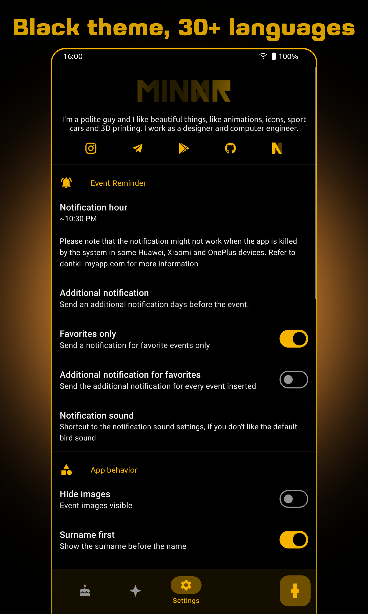
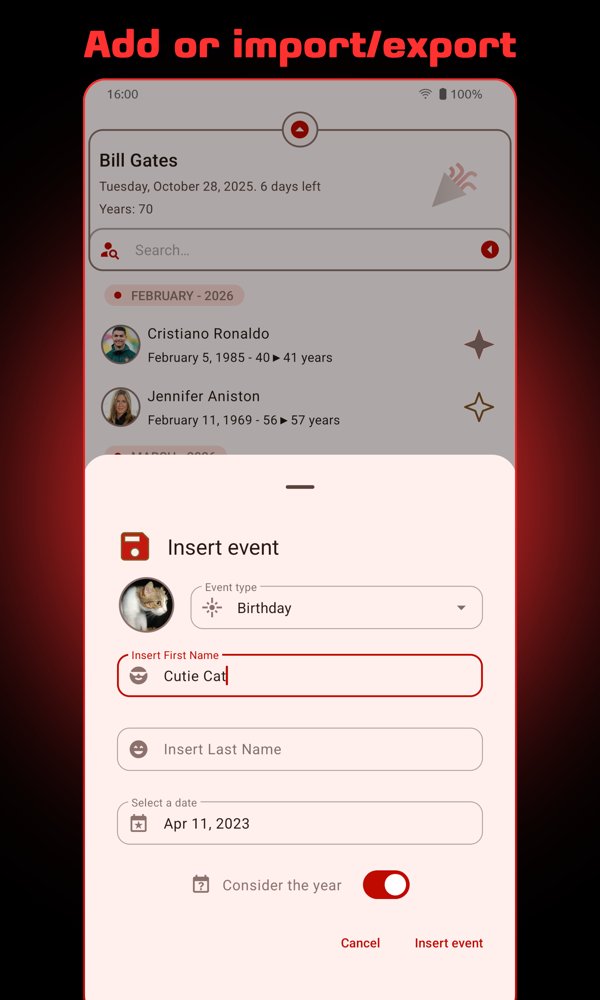
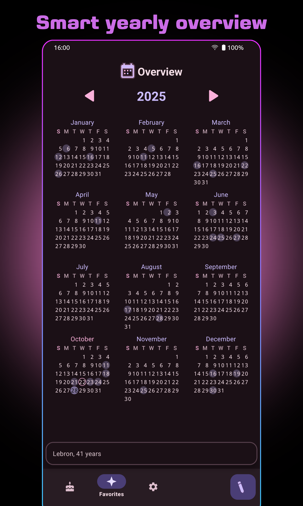
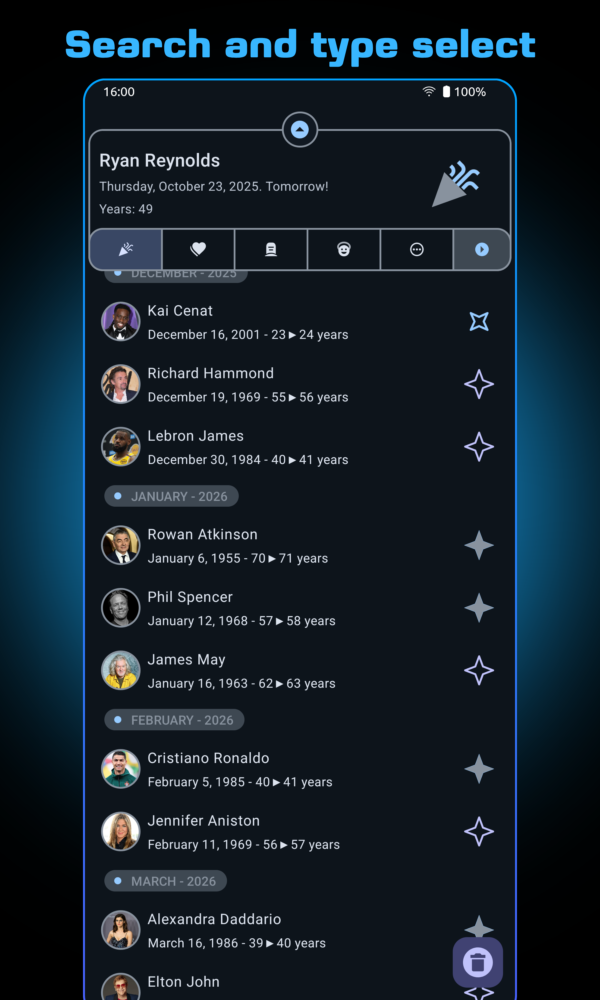
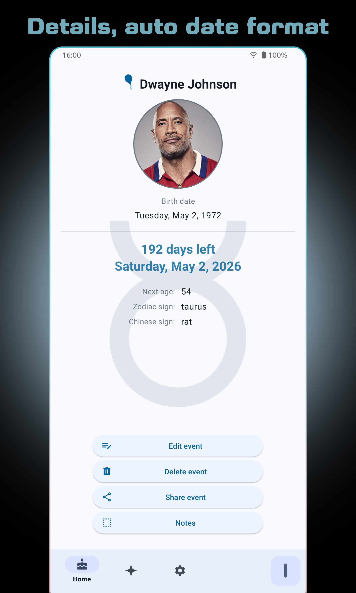
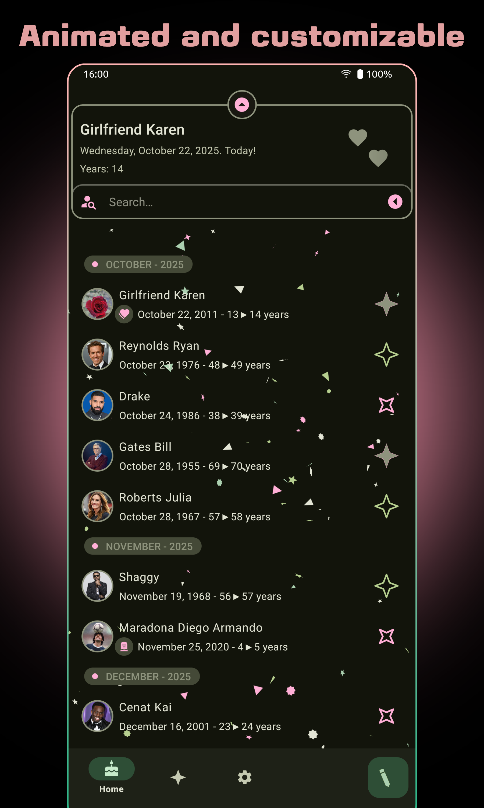
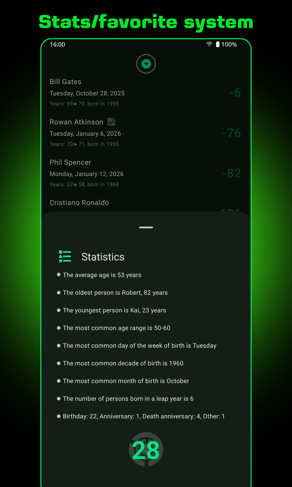
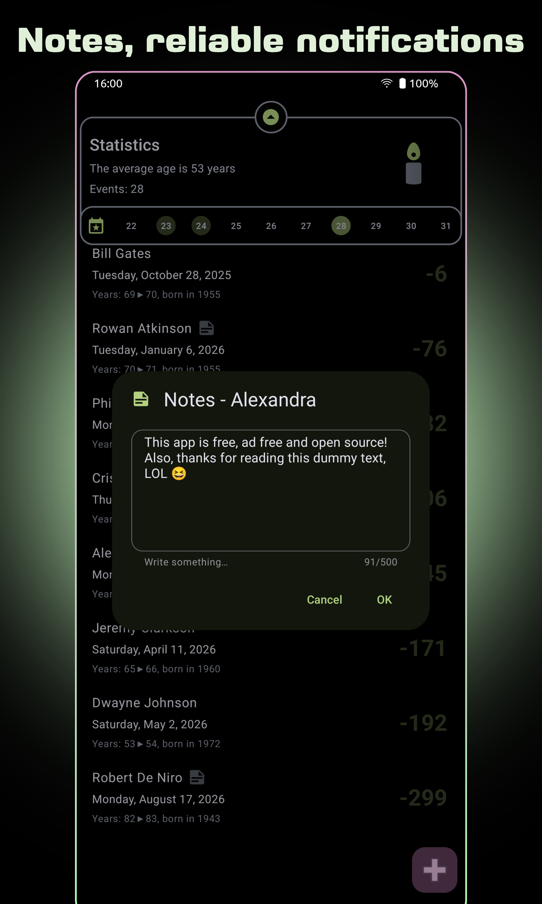
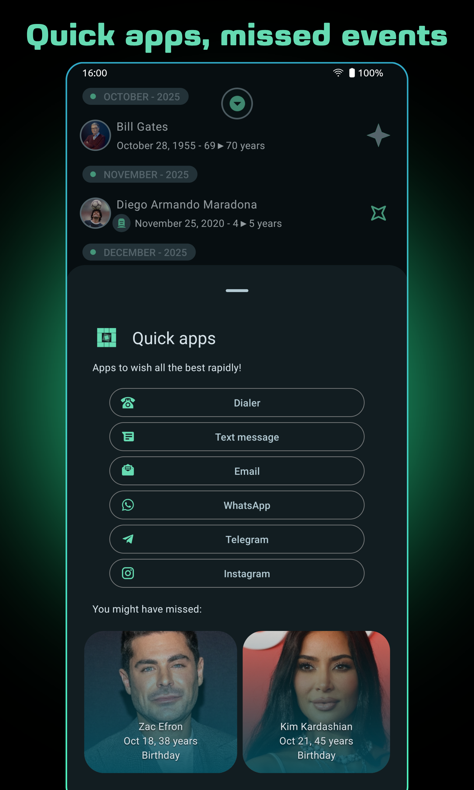

# Birday

An open source app to remember birthdays and events without having to rely on apps like Facebook or Google Calendar or set alarms manually.

  
  
  

## Introduction
This is an open source app to remember **birthdays** and other events in a fast, light and beautiful way. No less, no more. I had this idea considering that Google Calendar doesn't display an automatic notification the day of the birthday, and sometimes I need to remember a birthday for a person who is not in my Contacts. Also, adding too much events to the calendar makes it messy and I prefer to manage them separately. The main focus of this app is being easy to use, clean and lightweight. I'm always glad to add features, but only important and really useful features!

## Translations (guide and info below, refer to [Crowdin](https://crwd.in/birday))

| LANGUAGE                | SPECIAL THANKS    | UPDATED BY                  |
|:------------------------|:------------------|:----------------------------|
| **English**             | myself            | ar-maged, Commenter25       |
| **Spanish**             | myself            | Joseahfer                   |
| **Swedish**             | SlowNicoFish      |                             |
| **Dutch**               | stefanvi          |                             |
| **Italian**             | myself            | myself                      |
| **French**              | Mattis Biton      |                             |
| **Hungarian**           | Obi               |                             |
| **German**              | pizzapastamix     | WrstFngr, AlexanderRitter02 |
| **Vietnamese**          | Lee Huynh         | dmtrilc                     |
| **Russian**             | koterpillar       |                             |
| **Czech**               | Miloš Koliáš      | IQLogic                     |
| **Slovak**              | IQLogic           |                             |
| **Polish**              | mateusz-bak       |                             |
| **Croatian**            | Dominik Novosel   | Dominik Novosel             |
| **Portuguese**          | smarquespt        | smarquespt                  |
| **Brazilian**           | BadJuice67        | Paiusco                     |
| **Romanian**            | ygorigor          | ygorigor                    |
| **Traditional Chinese** | Still34           | daoxi                       |
| **Simplified Chinese**  | daoxi             | daoxi                       |
| **Catalan**             | retiolus          |                             |
| **Serbian**             | Th3Unkn0wn0n3     | vatonbero                   |
| **Ukrainian**           | taras             |                             |
| **Greek**               | Retrial           |                             |
| **Marathi**             | Ramesh Kumar      |                             |
| **Malayalam**           | Lavin-tom         |                             |
| **Hindi**               | assembleDebug     |                             |
| **Finnish**             | manaryde          |                             |
| **Turkish**             | Ömer Selim Öztürk |                             |
| **Basque**              | erral             |                             |

## Features
- Notification the day of the event (with selectable time and optional grouping for multiple events in the same day)
- Additional notification up to 21 days before the event (multiple selections are possible)
- Import from contacts or calendar (import on first launch, auto import on each launch option, selectable on conflict strategy)
- Easily backup and restore your saved events!
- Experimental CSV and JSON import/export
- insert an event manually, just specifying a first name, an optional last name, an image and a date (with optional year)
- Choose your favorite events to see detailed information about them and a countdown for each one
- Tap on an event to see every possible detail and the available actions
- The birthdays are also automagically backed up in cloud by Google Play Services when the app is installed from Play Store
- A set of stats (zodiac, average age and much more) when more than 5 events are inserted
- Easily delete, modify and share the saved events!
- Each event has an handy note field
- Easily hide the top cards to display the list in fullscreen
- Main list organized by month or alphabetically
- Quick glance row, to visualize the events in the next 10 days
- Yearly overview screen (advanced mode available)
- A nice searchbar and an event type selector
- Quick apps launcher
- Light, dark, Amoled black and system default theme
- Full Material 3 Expressive / Monet support
- Selectable accent (no app restart needed, 12 choices)
- Shimmer effect (it can be disabled) and confetti, because why not
- Name first or surname first choice
- Notification only for favorite events
- Hide and show images
- Material 3 configurable widgets (minimal and complete)
- Beautiful animations (and animated notification icon, both can be disabled, but if you do it, be aware that I hate you)
- Multiwindow / freeform full support
- Animated splashscreen and app intro, dynamic layouts and more
- Small and optimized apk size
- 30+ locales supported and counting!

## Screenshots

  
  
  
  
  

  
  
  
  
  

## Download
The app is available through Google Play and F-Droid\
\

## Credits and contributions
Birday uses some open source libraries, just a few:
- [TastiCalendar](https://github.com/m-i-n-a-r/tasticalendar)
- [Konfetti](https://github.com/DanielMartinus/Konfetti)
- [App Intro](https://github.com/AppIntro/AppIntro)
- [Shimmer](https://github.com/facebook/shimmer-android)

Top contributors (special thanks to them!):
- [Alberto Pedron](https://github.com/Alberto97) for the precious advices and for contributing with many useful pull requests
- [Dominik Novosel](https://github.com/DominikNovosel) for the suggestions, for supporting the project and for the LTS version
- [Simone Sestito](https://github.com/simonesestito) for adding useful features and for being a great friend

Currently, Birday supports the languages in the above table. If you want to translate the app in any other language or update an existing translation, just contact me or send a pull request: you'll be quoted both on GitHub and in the Play Store description. For a detailed guide on how to translate the app, refer to the [Wiki](https://github.com/m-i-n-a-r/birday/wiki/Translate-the-app)

This app was written during my free time as a training. It was first published on May 1, 2020. Many good devs helped me understanding the best practices and they taught me a lot of useful tricks. A special thank to every contributor here and on Reddit. and God bless Stack Overflow.
